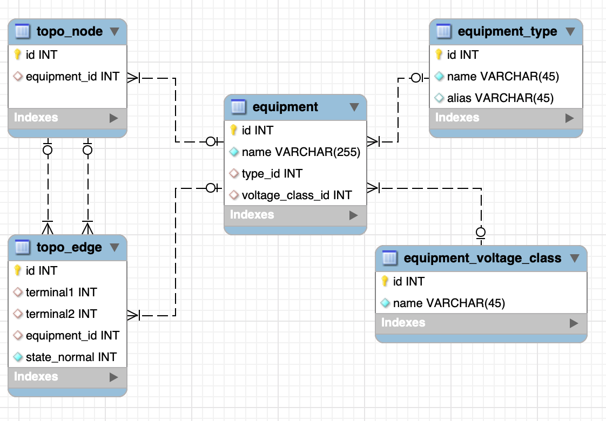

# topogrid
Package topogrid contains implementations of basic power grid algorithms based on the grid topology.
We use three main things - node, edge and equipment. Each power equipment can be represented as a topological node or edge.

## Database

## Using
```golang
topology := topogrid.New(len(nodes))

for _, node := range nodes {
  topology.AddNode(node.Id, 
    node.EquipmentId, 
    node.EquipmentTypeId, 
    node.EquipmentName)
}

for _, edge := range edges {
  err := topology.AddEdge(edge.Id, 
    edge.Terminal1, 
    edge.Terminal2, 
    edge.StateNormal, 
    edge.EquipmentId, 
    edge.EquipmentTypeId, 
    edge.EquipmentName)
  if err != nil {
    log.Errorf("%v", err)
  }
}
```
