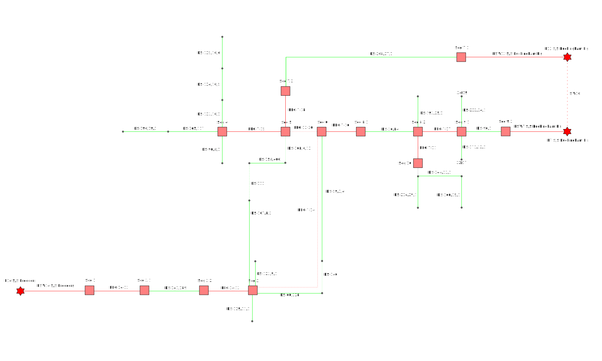

# topogrid
Package topogrid contains implementations of basic power grid algorithms based on the grid topology.
We use three main things - node, edge and equipment. Each power equipment can be represented as a topological node or edge.

## List of terms and abbreviations
* Edge: A link between two nodes.
* Node: The name for any single junction. Nodes are connected to one another by edges.
* Terminal: The endpoint of a power grid equipment, represented by node.
## Distribution grid example


## Graph example

## Database
The power system topology is stored in the database as a set of tables.

## Using

```go
type EquipmentStruct struct {
	id              int
	typeId          int
	name            string
	electricalState uint8
	poweredBy       map[int]int64
	switchState     int
}

type NodeStruct struct {
	idx             int
	id              int
	equipmentId     int
	electricalState uint8
}

type TerminalStruct struct {
	node1Id          int
	node2Id          int
	numberOfSwitches int64
}

type EdgeStruct struct {
	idx         int
	id          int
	equipmentId int
	terminal    TerminalStruct
}
```
```go
topology := topogrid.New(len(nodes))

for _, node := range nodes {
  topology.AddNode(node.Id, 
    node.EquipmentId, 
    node.EquipmentTypeId, 
    node.EquipmentName)
}

for _, edge := range edges {
  err := topology.AddEdge(edge.Id, 
    edge.Terminal1, 
    edge.Terminal2, 
    edge.StateNormal, 
    edge.EquipmentId, 
    edge.EquipmentTypeId, 
    edge.EquipmentName)
  if err != nil {
    log.Errorf("%v", err)
  }
}
```
### EquipmentNameByEquipmentId
Returns a string with node name from the equipment id
```go
func (t *TopologyGridStruct) EquipmentNameByEquipmentId(equipmentId int) string
```

### EquipmentNameByNodeIdx 
Returns a string with node name from the node index
```go
func (t *TopologyGridStruct) EquipmentNameByNodeIdx(idx int) string
```

###  EquipmentNameByNodeId
Returns a string with node name from the node id
```go
func (t *TopologyGridStruct) EquipmentNameByNodeId(id int) string
```

### EquipmentNameByNodeIdArray
Returns a string with node names separated by ',' from an array of node ids
```go
func (t *TopologyGridStruct) EquipmentNameByNodeIdArray(idArray []int) string
```

### EquipmentNameByEdgeIdx
Returns a string with node name from the node index
```go
func (t *TopologyGridStruct) EquipmentNameByEdgeIdx(idx int) string
```

### EquipmentNameByEdgeId
Returns a string with node name from the node id
```go
func (t *TopologyGridStruct) EquipmentNameByEdgeId(id int) string
```

### NodeIsPoweredBy
Get an array of nodes id with the type of equipment "TypePower" from which the specified node is powered with the current electrical state (On/Off) of the circuit breakers
```go
for _, node := range nodes {
  poweredBy, err := topology.NodeIsPoweredBy(node.Id)
    if err != nil {
      log.Errorf("%v", err)
    }
    log.Debugf("%d:%s <- %v:%s", node.Id, topology.EquipmentNameByNodeId(node.Id), poweredBy, topology.EquipmentNameByNodeIdArray(poweredBy))
}
```
### NodeCanBePoweredBy 
Get an array of nodes id with the type of equipment "Power", from which the specified node can be powered regardless of the current electrical state (On/Off) of the circuit breakers
```go
for _, node := range nodes {
  poweredBy, err := topology.NodeCanBePoweredBy(node.Id)
    if err != nil {
      log.Errorf("%v", err)
    }
    log.Debugf("%d:%s <- %v:%s", node.Id, topology.EquipmentNameByNodeId(node.Id), poweredBy, topology.EquipmentNameByNodeIdArray(poweredBy))
}
```
### CircuitBreakersNextToNode 
Get an array of IDs of circuit breakers next to the node. If we need to isolate some area of the electrical network, we need to find all circuit breakers near a node in that area.
```go
for _, node := range nodes {
  nextTo, err := topology.CircuitBreakersNextToNode(node.Id)
    if err != nil {
      log.Errorf("%v", err)
    }
    log.Debugf("%d:%s <- %v:%s", node.Id, topology.EquipmentNameByNodeId(node.Id), poweredBy, topology.EquipmentNameByNodeIdArray(nextTo))
}
```

